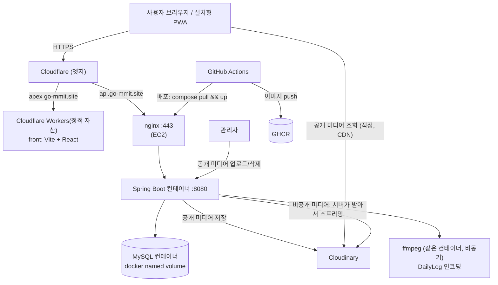

# 인프라 설계 (MVP)

> 이 문서가 인프라 결정의 단일 출처다. 변경 시 여기부터 고친다.
> 최종 수정: 2026-09-04

---

## 1. 목표와 범위

### 1.1 이번에 만드는 것 (MVP)

- EC2 1대 위에 `nginx + Spring Boot + MySQL`을 Docker Compose로 구동
- Cloudflare: DNS + 프론트(Cloudflare Workers, 정적 자산 배포 — 예전 문서엔 Pages로 적혀있었으나
  실제로는 Workers. 대시보드가 통합돼 신규 프로젝트는 기본이 Workers, Pages는 레거시 경로로만
  생성 가능) + 엣지(TLS/DDoS)
- GitHub Actions로 백엔드 이미지 빌드 → 배포 (중단 배포, 무중단은 다음 단계)
- 사진 인증 + 2초 클립(추후) 저장·서빙
- **DailyLog 서빙까지 MVP 포함**: 그룹·일자별로 서버가 ffmpeg로 타일 컴필레이션 영상 생성
  (1~48초, 대부분 5초 내외, 저화질~중화질), 그룹 구성원이 조회. 새벽 4시 직전 또는 일과
  시간 중 생성, 서두르지 않아도 됨.

### 1.2 설계만 하고 미루는 것 (문서에 "추후 확장"으로만)

| 항목 | 우선순위 | 메모 |
|---|---|---|
| 무중단 배포 | 중상 (낮지 않음) | compose 구조를 블루-그린 가능하게 잡아두되 지금은 중단 배포 |
| 라이브 (Zoom/Discord류, WebRTC SFU) | 낮음 | 영상까지는 지금 인프라로, 라이브는 별도 |
| 네이티브 앱 (APK → 원스토어 → Play → App Store) | 낮음 | KMP WebView. 앱 전용 signed-url 서빙 분기는 그때 |
| 별도 staging 환경 | 낮음 | 비용·계정 제약. 단일 환경 |
| 모니터링 (Prometheus/Loki) | 중 | Grafana Cloud 무료 tier 우선, 자체 호스팅은 별도 Terraform 모듈 |

### 1.3 제약 (AWS 계정 규칙)

- **결재 없이 생성 가능**: EC2 / RDS / S3 각 1대(프리티어 스펙), VPC 1개(인터넷 게이트웨이 1,
  탄력적 IP 1)
- **문의 필요**: NAT 게이트웨이
- **결재요청 필요 (사유 첨부)**: 그 외 모든 서비스, 또는 같은 서비스 2개 이상
- **예산**: 월 최대 8만원 추정. 최소로 쓸 것
- **네이밍**: 리소스 이름 `team1-<컴포넌트>`. 인스턴스에 태그 `Team: devcos-team01` 필수.
  규칙 안 지키면 불시 삭제될 수 있음 (`team1` / `team01` 표기 차이는 관리자에게 확인)
- **시크릿**: DB 비밀번호 등 절대 커밋 금지. 일반 보안사항 준수
- **OS 이미지**: Amazon Linux / Ubuntu / RHEL / Debian 만. mac / Windows / SUSE 금지
- **매일 18:00 인스턴스 정지**: 루트 계정이 stop. 우리는 IAM 사용자라 막을 수 없음
  (옛 계정 기준. 새 계정 이전 후 24시간 가동 — Q30)
- **서빙 기간**: 최소 1개월, 최대 12개월 (도메인 비용 포함)

---

## 2. 아키텍처 한눈에



핵심: **프론트는 Cloudflare Workers(정적 자산), 백엔드는 EC2 1대, DB도 그 EC2 안 컨테이너.**
공개 미디어(아바타 옷, 배경)는 사용자가 Cloudinary에서 직접 본다. 비공개 미디어(체크인 사진,
DailyLog 영상)만 서버가 바이트 경로에 들어간다.

---

## 3. 용어 정리 (질문에서 나온 것들)

### RDS vs "EC2에 MySQL 컨테이너"

- **RDS** (Relational Database Service): AWS가 관리하는 DB. AWS가 MySQL 프로세스·백업·패치·
  장애조치를 담당하고 우리는 접속 엔드포인트만 받는다. 프리티어는 `db.t4g.micro` + 20GB,
  **12개월 뒤 유료**.
- **EC2에 MySQL 컨테이너**: 우리가 직접 MySQL을 Docker로 EC2에 띄운다. 관리 전부 우리 몫,
  대신 추가 비용 없음(이미 있는 EC2 사용).
- 둘은 **양자택일**이다. 하나를 고르는 것이지 같이 쓰는 게 아니다.

| | RDS | EC2 안 MySQL 컨테이너 |
|---|---|---|
| 비용 | 프리티어 12개월 무료 → **이후 월 $12~15+** | **추가 $0** (있는 EC2 사용) |
| 백업 | 자동 (PITR, 스냅샷 버튼) | **직접** (`mysqldump` 크론 + EBS 스냅샷) |
| 패치·업그레이드 | 자동 | 직접 (이미지 태그 올리고 재기동) |
| 장애 격리 | DB가 앱과 별도 호스트 | **EC2 죽으면 DB도 같이 죽음** (같은 장애 도메인) |
| 리소스 경합 | 없음 | JVM + ffmpeg + MySQL이 2GB 한 박스에서 경쟁 |
| 접근 | 파라미터 그룹으로만 (SSH 불가) | 컨테이너 자유롭게 |
| 로컬 개발 대칭 | 로컬 H2 → RDS MySQL | 로컬 H2 → 컨테이너 MySQL (동일) |
| 계정 규칙 | "1대까지 결재 없이"지만 프리티어 초과 시 결재 | EC2 1대 안에 포함 |
| 전환 비용 | — | 나중에 RDS로: `.env`의 `DB_HOST`만 교체 |

- **결정: EC2 안 MySQL 컨테이너.** MVP 기간 1~12개월 + 소규모 + 비용 최소가 우선. RDS의
  자동 백업·패치는 편하지만 12개월 절벽과 (프리티어 초과 시) 결재를 감수할 이유가 없다.
  트래픽·안정성이 실제로 필요해지면 그때 RDS로 전환한다(엔드포인트만 바꾸면 됨).

### EBS (Elastic Block Store)

- EC2에 붙는 가상 디스크. EC2의 루트 파일시스템도 이미 EBS다.
- **왜 별도 볼륨이 필요한가**: 인스턴스를 재생성(terminate)하면 루트 EBS도 같이 삭제된다 →
  DB 데이터 유실. 별도 EBS 볼륨에 MySQL 데이터를 두면 인스턴스를 갈아끼워도 볼륨만 옮겨
  붙이면 데이터가 유지된다. **스냅샷** = 특정 시점 백업.
- 18:00 정지는 terminate가 아니라 stop이라 EBS는 유지된다. 하지만 나중에 무중단 배포·인스턴스
  교체 작업이 terminate를 유발하므로 지금부터 데이터를 별도 볼륨에 두는 게 안전하다.

### 리버스 프록시 / 왜 nginx인가

Spring이 443 포트를 직접 열어도 동작은 한다. nginx를 앞에 두는 이유:

1. **TLS 종단** — nginx가 인증서를 들고 HTTPS를 처리하고 Spring과는 평문 HTTP로 통신.
   Spring을 재시작해도 TLS·라우팅은 안 끊긴다.
2. **443 단일 입구 + 경로 분기** — `/api`, `/media` → Spring:8080. 나중에 서비스가 늘면 여기서 분기.
3. **업로드 크기 제한** (`client_max_body_size`) 을 Spring 앞에서 컷.
4. 느린 클라이언트 버퍼링, gzip, `/media` 캐시 헤더, 커넥션 관리.
5. **무중단 배포 훅** — `upstream` 대상만 바꿔 새 Spring 컨테이너로 전환(블루-그린).
6. 레이트리밋, 잘못된 경로 차단, 기본 방어.

Cloudflare가 앞에 있어도 nginx는 여전히 필요하다: 오리진 TLS 인증서, 바디 크기 제한,
블루-그린 전환, Spring을 인터넷에 직접 노출하지 않기.

**"nginx ↔ Spring을 평문 HTTP로 하는 건 안 위험한가?"** — 안 위험하다. 인터넷 구간은 전부
암호화된다: 사용자 ↔ Cloudflare (TLS), Cloudflare ↔ nginx (TLS, Origin CA 인증서). nginx와
Spring은 **같은 EC2 안** Docker 내부 네트워크(또는 `127.0.0.1`)에서만 통신하고, 그 패킷은
인스턴스 밖으로 나가지 않는다. 이 구간을 도청하려면 이미 그 EC2의 root를 장악한 상태여야
하는데, 그 시점엔 TLS가 있든 없든 의미가 없다. 이건 표준 관행(엣지/프록시에서 TLS 종단).
**전제**: Spring 포트(8080)를 절대 외부에 노출하지 않는다 — compose에서 `expose`만 쓰고
`ports` 매핑은 nginx에만.

### apex 도메인

- 서브도메인이 없는 최상위 루트 도메인. `example.com` (= 루트 도메인, 네이키드 도메인, zone apex).
- `www.example.com` · `app.example.com` · `api.example.com` 은 서브도메인.
- **왜 "apex"인가**: 한 도메인의 DNS 레코드 묶음을 zone이라 부르는데, `example.com` 존을
  트리로 보면 `www`·`mail`·`api` 등은 하위 가지이고 `example.com` 자체가 그 트리의 **꼭대기
  (apex, 라틴어로 '정점')**다. 그래서 zone apex = apex domain = root domain = naked domain,
  전부 같은 말.

### PWA / service worker / vite-plugin-pwa

- **설치형 PWA 3요소**: (1) `manifest.json`, (2) HTTPS, (3) fetch 핸들러가 있는 등록된
  service worker.
- `manifest.json` 은 이미 추가했다 → 1개 완료. HTTPS는 Cloudflare가 준다 → 2개 완료.
  **보통 빠지는 게 service worker**다. Android 설치·오프라인·앱셸 캐시에 필요하다.
- **`manifest.json` 을 추가한다고 service worker가 자동으로 생기지 않는다.** 둘은 완전히
  별개다. manifest는 정적 JSON(이름·아이콘·시작 URL·테마색 — "설치되면 어떻게 보이나"),
  service worker는 별도로 작성해서 `navigator.serviceWorker.register()` 로 등록해야 하는
  실행 스크립트다. manifest만 있으면 "웹사이트 바로가기" 수준이고, Android Chrome은 fetch
  핸들러가 있는 SW 없이는 진짜 설치(WebAPK)를 해주지 않는다. → SW를 추가해야 한다.
- **service worker**: 브라우저가 백그라운드에서 돌리는 스크립트. 네트워크 요청을 가로채
  캐시에서 응답하거나(오프라인), 새 버전 갱신을 처리한다.
- **`vite-plugin-pwa`**: 그 service worker를 자동 생성(Workbox 기반)하고, 빌드마다 해시가
  붙는 자산 목록을 precache에 넣고, 매니페스트를 주입하고, 업데이트 흐름을 처리하는 Vite 플러그인.
  손으로 `sw.js` 를 써도 되지만 자산 목록·갱신 로직을 수동 관리해야 해서 플러그인을 권장한다.

### 런북 (runbook)

운영 절차 문서. 루틴·비상 작업의 단계별 안내. 예: 배포하는 법, DB 복구하는 법, 롤백하는 법,
4시 job 실패 시 대응, "DB 초기화 = 스토리지 초기화" 규칙. 온콜 때 펴보는 "책"이라 runbook.
이 인프라 작업 때 `infra/docs/infra-runbook.md` 로 만든다.

- 오래된 용어다. 메인프레임·전화교환국 운영 시대(1970년대~)의 물리적 절차 바인더에서 왔고,
  지금도 SRE/DevOps에서 그대로 쓴다(Google SRE 책이 대중화). "playbook"과 거의 동의어 —
  playbook이 판단·시나리오를 좀 더 담고, runbook이 좀 더 기계적 절차다.

### Terraform state / 잠금(lock) / HCP Terraform

- **state**: Terraform이 "코드로 무엇을 만들었나"를 기록하는 JSON 파일. 이게 없으면 실제 AWS
  리소스와 `.tf` 코드를 대조할 수 없다.
- **잠금(lock)**: 두 명이 동시에 `terraform apply` 하면 state를 동시에 읽고 써서 깨진다.
  잠금은 "한 번에 한 명만 쓴다"를 강제하는 뮤텍스.
  - 예전 방식: DynamoDB 테이블에 락 아이템을 둔다.
  - Terraform 1.10+ : S3 자체의 조건부 쓰기로 락을 건다 (`use_lockfile = true`). DynamoDB 불필요.
- **HCP Terraform** (구 Terraform Cloud): HashiCorp가 호스팅하는 SaaS. state 저장 + 원격
  실행 + 웹 UI + 잠금 내장. 무료 5인까지. 단점: 외부 계정에 의존하고 apply가 원격에서 돈다.

**"S3가 필요한가? EC2 + Cloudinary로 다 되는 줄 알았는데."** — 앱 런타임에는 S3가 필요
없다(미디어는 Cloudinary, DB는 EC2). S3 얘기가 나온 건 **Terraform state를 어디 둘까** 하나
때문이다. state를 로컬 파일로만 두면 팀원이 각자 다른 state를 갖게 되고 동시에 apply하면
깨진다. 선택지는 Q4 참고 — S3는 그 중 한 방법일 뿐이고, HCP Terraform(무료)이나 "1명만
apply 담당 + 로컬 state" 로도 된다.

---

## 4. 결정 사항 (라운드 1)

### Q1 — 범위 경계 → (a) 채택

MVP만 만든다. 무중단·라이브·앱·staging은 설계 고려만 하고 이 문서 1.2 표에 남긴다.
DailyLog 생성·서빙은 MVP에 포함(1.1 참고).

### Q2 — 산출물 레이아웃 → 추천대로

monorepo 안 `infra/` 디렉터리. `feat/infra-idk` → 다른 브랜치 머지 후 → `main`.
파일 목록은 5장 참고.

### Q3 — EC2

| 항목 | 결정 | 이유 |
|---|---|---|
| Region | `ap-northeast-2` (서울) | 사용자 위치 |
| AMI | **Amazon Linux 2023 (x86_64)** | EC2에 최적화, dnf/systemd, 무료, 규칙상 허용 |
| Instance | **`t3a.medium`** (2 vCPU, 4GB, x86/AMD) | Java 25·nginx·MySQL·ffmpeg 모두 x86_64 지원. 4GB로 몽타주·갤러리 동시 부하 여유 확보 |
| Swap | 파일 스왑 2GB | 4GB RAM에서도 JVM+MySQL+ffmpeg 동시 부하 안전망으로 유지. 단, cgroup 메모리 한도(`mem_limit`) 초과는 swap이 못 막음 — 실측상 컨테이너가 swap 안 쓰고 먼저 OOM-kill됨(아래 "4GB 메모리 배분" 참고) |
| EBS | 루트 gp3 30GB 단일 + docker `mysql-data` named volume (Q13) | 별도 볼륨은 안 씀 — 단순. 백업은 야간 mysqldump. 볼륨 스냅샷은 필요 시 수동(자동 DLM 은 부수 서비스 결재 회피로 제외) |
| EIP | 1개, 인스턴스에 attach | 18:00 stop/start 후에도 IP 유지. **주의: 2024년부터 EIP는 attach 여부 무관 시간당 과금(~월 $3.6)** |
| 보안그룹 | 443 = Cloudflare IP 대역만, 22 = 기본 미개방(배포·디버그 = SSM), `var.ssh_allowed_cidrs` 로 운영자 1인 `/32` 예외만 (Q14) | 오리진 우회 차단 |

**Terraform 관리 대상**: VPC(1) / IGW / 퍼블릭 서브넷(1) / 라우트테이블 / EC2 / EIP /
보안그룹 / IAM 역할(SSM) / cloudflare DNS 레코드 / CloudWatch 재부팅 알람(Q30, 옛 03:30
start Scheduler 대체). provider 블록에 `default_tags { tags = { Team = "devcos-team01" } }`
→ 모든 AWS 리소스에 태그 자동. (key pair 미사용 — SSM 이 기본. SSH 예외 1인은 authorized_keys 직접 등록, Q14 추가결정)

**예산 개산**: `t3a.medium` 24시간 ≈ 월 $24, gp3 30GB ≈ $2.4, EIP ≈ $3.6, 아웃바운드 전송
100GB/월 무료. 24시간 가동(Q30)이라 합계 ≈ $30. 8만원(≈ $57) 안에 충분.

### Q4 — Terraform state → 3안 비교 (결론은 4c Q22 = B)

| 안 | 방법 | 장점 | 단점 |
|---|---|---|---|
| A | **S3 버킷 1개** `team1-tfstate` + `use_lockfile=true` | AWS 안에서 끝, 표준, 잠금 내장 | 버킷 1회 수동 생성, S3 프리티어 1개를 여기 씀 |
| B | **HCP Terraform** 무료 tier | AWS S3 안 건드림, 잠금·UI·이력 내장, 무료 5인 | 외부 계정 가입, apply가 원격 실행(로컬 실행 옵션은 있음) |
| C | **로컬 state + 1명만 apply 담당** | 아무 인프라도 안 씀, 즉시 시작 | `.tfstate` 를 그 1명이 백업, 협업 시 규율 필요, git 커밋 비권장 |

- 팀 규모 5명, 강의 프로젝트, 인프라 담당자 1인이 주로 apply → **C도 현실적**. 다만
  담당자 노트북이 죽으면 state 유실 → 최소한 state 파일을 팀 드라이브에 백업하는 규칙 필요.
- 협업·안전을 조금이라도 원하면 **B(HCP Terraform)** 가 S3보다 깔끔(버킷 부트스트랩 없음).
- → **4c Q22: B 채택.**

### Q5 — 데이터베이스 → EC2 안 MySQL 8 컨테이너

- **RDS 안 씀**: 정당화 사유가 없고(규모가 작음), 12개월 뒤 과금 절벽이 생긴다.
- MySQL 8 컨테이너, 데이터는 별도 EBS 데이터 볼륨에 마운트.
- 백업: 야간 `mysqldump` + gzip, 7일 보관 (저장 위치는 라운드 2 — 디스크 / Cloudflare R2 무료 10GB / EBS 스냅샷).
- 백엔드 개발자 관점: 로컬은 지금처럼 H2 파일 DB, 배포는 MySQL. 코드 변경 없이 `application-prod.yml`
  + `.env` 접속정보만 다르다. (이미 `application-prod.yml`에 `DB_HOST` 등 환경변수로 잡혀 있음)

**"애초에 백업이 필요한가?"** — 필요하다. 계정·그룹·챌린지·체크인 기록·포인트·아이템이 전부
DB에 있고, 이게 날아가면 서비스가 끝난다. 데모/평가 중에 마이그레이션 실수·`DROP` 실수·
볼륨 손상·디스크 풀 중 하나만 터져도 0에서 시작이다. `mysqldump` 크론 하나는 몇 초에
수 MB짜리라 비용이 사실상 없다. "RDS가 필요한가"(= AWS가 백업을 자동으로 해주는가)와
"백업이 필요한가"는 별개 질문이다 — **백업은 어느 쪽을 골라도 필요**하고, EC2 컨테이너를
골랐으니 우리가 크론으로 한다.

### Q6 — EC2 위 구성 + nginx + 모니터링

- **"온박스"는 내가 쓴 은어였다.** "EC2 인스턴스 한 대 위에서 도는 것들"이라는 뜻이고 정식
  용어가 아니다. 아래부터는 안 쓴다.
- `docker-compose.yml` 하나에 `nginx` / `back` / `mysql` 3개 서비스.
  - `back` 이미지는 GHCR에서 pull (EC2에서 빌드 안 함 — 빌드는 메모리·CPU를 많이 먹는다).
  - `restart: unless-stopped`, `depends_on: mysql (condition: service_healthy)`.
  - `back` 헬스체크 = Spring Actuator `/actuator/health`.
- nginx 필요성은 3장 "리버스 프록시" 참고. 요약: TLS 종단 + 경로 분기 + 업로드 제한 +
  무중단 배포 훅.
- **공개 미디어** (아바타 옷, 배경 등): 관리자 업로드/삭제만 서버 경유, 사용자 조회는
  Cloudinary CDN 직접. nginx `/media` 프록시는 **비공개 미디어(체크인 사진, DailyLog 영상)만**
  탄다.
- **모니터링 (Prometheus + Loki, 나중)**:
  - **1순위 권장**: Grafana Cloud 무료 tier (메트릭 10k 시리즈, 로그 50GB/14일). EC2엔
    에이전트(Grafana Alloy)만 설치. **2번째 EC2 불필요 → 결재 불필요.**
  - 대안: 자체 호스팅 Prom+Loki를 **별도 EC2**에. `infra/terraform/monitoring/` 를 별도
    state로 분리 → `terraform apply` 로 생성, `terraform destroy` 로 폐기(쓸 때만 과금).
    단 2번째 EC2 = **결재 필요**.
  - 앱 EC2엔 지금 exporter를 안 깔아도 된다. Actuator + Micrometer 엔드포인트만 열어두면
    나중에 스크랩 가능.
- **Spring 의존성**: 인프라 작업 시 `spring-boot-starter-actuator` 추가(헬스체크).

### Q7 — DNS / TLS

- 도메인 1개 → Cloudflare 네임서버로 이전.
- **Cloudflare 프록시 ON** + SSL 모드 **Full (strict)** + 오리진 nginx에 **Cloudflare Origin
  CA 인증서**(무료, 15년). certbot 갱신 크론 불필요. DDoS 완화, 공개 자산 엣지 캐시.

**"100MB 제한이면 폰 화면 영상 몇 초?"**

- 100MB는 **Cloudflare 무료/프로 플랜의 요청 바디(업로드) 최대 크기**다. 응답(다운로드)엔
  안 걸린다.
- 폰 세로 영상(1080×1920) H.264 기준 대략:
  - 8~12 Mbps → 100MB ≈ **60~90초**
  - 압축(720p, 5 Mbps) → ~150초+
  - HEVC(4~6 Mbps) → ~130~200초
- **그런데 이건 업로드에만 해당한다.** 사용자 업로드는 사진(수 MB)·2초 클립(수 MB)뿐이라
  100MB 근처도 안 간다. DailyLog(최대 48초, ~15~30MB)는 서버가 생성하는 것이지 업로드가
  아니다. → **100MB는 이 앱에서 실질적 제약이 아니다.**

**"Cloudflare 프록시가 링크 유출 방지(비즈니스 결정)를 해치나? / byte-path 부담이 해결되나?"**

- 비즈니스 결정: 사용자에게 Cloudinary signed URL / signed cookie를 주지 않는다(유료 기능이고,
  signed URL은 그 자체가 bearer 토큰이라 재공유되면 끝). 대신 비공개 미디어는 **Spring 서버를
  거쳐** 매 요청 인가를 재검사한다. 이건 프라이버시·재공유 차단 결정이지 성능 결정이 아니다.
- **Cloudflare가 앞에 있어도 이 구조는 그대로고, 해칠 것도 없다.**
  - 흐름: 클라이언트 → Cloudflare → nginx → Spring `/api/media/{key}` → Spring이 인증(단기
    httpOnly access 쿠키) 검사 → Spring이 Cloudinary에서 **서버측 서명 URL**로 바이트를 받아옴
    (클라이언트에 절대 노출 안 됨) → 스트리밍.
  - 사용자가 쥐는 URL = `https://api.example.com/api/media/abc` — 여전히 우리 엔드포인트,
    여전히 매 요청 인증 재검사. 로그아웃 상태로 남에게 공유 → 401. Cloudflare 유무와 동일.
- **⚠️ 라운드 1 정정**: "Cloudflare 엣지 캐시가 byte-path 부담을 완화한다"고 했는데
  **비공개 미디어엔 틀린 말이다.** 비공개 응답은 `Cache-Control: private, no-store` 라서
  Cloudflare가 캐시하지 않는다(캐시하면 쿠키를 무시하고 아무한테나 준다 = 사고). **비공개
  DailyLog/체크인 바이트는 계속 100% 서버가 나른다.** Cloudflare가 주는 이득은 공개 자산 캐시,
  API 보호, DDoS, TLS뿐이다.
- **결론**: 비즈니스 결정은 그대로 유효하고 옳다. Cloudflare가 그 부담을 덜어주지 않는다.
  MVP 트래픽에선 EC2 1대가 감당 가능하다. 부담이 커지면 탈출구는 (a) 유료 Cloudinary 토큰
  인증, (b) CloudFront 서명 쿠키 — 둘 다 나중, 둘 다 비즈니스 결정 재검토가 필요한 사안이다.
  지금 인프라로는 **비공개 미디어 대역폭 = EC2 아웃바운드**로 잡고 상한(월 100GB 무료)만
  주시한다.

### Q8 — 프론트 배포 + PWA + 도메인

- **Cloudflare Workers**(정적 자산, Pages 아님) + GitHub 연동(Workers Builds) 자동 배포. 빌드
  루트 `front/`, 명령 `pnpm build`, 출력 `dist`.
  - ⚠️ **2026-09-12 정정**: 이 Git 연동이 끊김(org GitHub App 권한 보류 중) → 대체로
    `.github/workflows/deploy-front.yml`(GitHub Actions, `wrangler deploy`) 추가함.
    연동 복구되면 둘 중 하나로 정리할 것.
- 도메인: **apex `go-mmit.site` = 앱(Workers)**, **`api.go-mmit.site` = 백엔드(EC2)**.
  (`go-mmit.site` 는 임시 placeholder — Q23 경고 참고)
  - 대안: `app.go-mmit.site` = 앱, apex는 app으로 리다이렉트. 취향 차이.
- 백엔드 `CORS_ALLOWED_ORIGINS = https://go-mmit.site`.
- **PWA**: `manifest.json` 은 이미 있음 → service worker가 남았다. `vite-plugin-pwa` 추가:
  `registerType: 'autoUpdate'`, 앱셸 precache, `/api` 는 network-first. 새 배포 시 자동 갱신도 처리.

### Q9 — 이미지 빌드 + CD → 확정

- 레지스트리: **GHCR** (무료). 패키지는 private — EC2에서 `read:packages` PAT로 1회 `docker login`.
- `.github/workflows/deploy.yml`: `main` 머지 → 백엔드 `docker build`
  (Q3가 x86이므로 `buildx --platform linux/amd64`, ubuntu-latest 러너가 네이티브라 QEMU 불필요) → GHCR push → EC2에서
  `docker compose pull && docker compose up -d` → `/actuator/health` 확인.
- Flyway는 앱 부팅 시 자동 마이그레이션 (별도 배포 스텝 없음).
- 배포 채널: SSH 대신 **AWS SSM `send-command`** 권장 (포트 22를 안 열어도 됨). 라운드 2 확정.
- **→ Q30 에서 대체**: Pull 배포(EC2 폴러가 GHCR `prod` 감시). SSM 은 운영자 셸 접속용으로만 남음.

### Q10 — 시크릿 관리 → 확정

- **`/opt/team1-app/.env` 가 소스. 최초 1회 수동 배치**(`chmod 600`, 템플릿 `infra/compose/.env.example`,
  절차 runbook 1-4). compose `env_file` 로 주입. SSM Parameter Store는 이 규모에 오버킬.
- **배포(`deploy.sh`)는 `.env` 를 렌더하지 않는다** — `IMAGE_TAG` 한 줄만 갱신한다. 시크릿 값
  변경·회전은 SSM 셸로 `.env` 를 직접 고친 뒤 `docker compose up -d <active 색>`(bare `up -d` 는 두 색을 다 띄움).
  (GitHub Actions 로 렌더하려면 전체 `.env` 를 Actions Secret 하나에 넣고 배포 스텝에서 써야 하는데,
  현재는 그 복잡도를 안 지고 수동 배치로 간다.)
- 항목 목록은 `infra/compose/.env.example` 이 단일 출처. 배포용 GitHub Secrets 는 없다(Q30, `GITHUB_TOKEN` 만).

### Q11 — 스케줄러(새벽 4시) + 18:00 정지

> 18:00 정지는 옛 계정 기준. 새 계정은 24시간 가동(Q30) — 아래 자동 복귀·멱등 job 은 재부팅 대비로 유효.

**"Spring Batch deps가 뭐야?"**

- Gradle 의존성 한 줄: `implementation 'org.springframework.boot:spring-boot-starter-batch'`.
- Spring Batch = 대규모 배치용 프레임워크(청크 단위 read-process-write, 중단 후 재시작, job
  메타데이터 테이블). README에는 적혀 있지만 `build.gradle` 엔 아직 없다.
- 새벽 4시 정산(포인트·스트릭·DailyLog 생성)에 필요한가? 사용자 수백~천 명 규모면
  **`@Scheduled` + `@Transactional` 서비스로 충분**하다. Spring Batch는 수백만 행·중단 재시작·
  청크 커밋·job 이력이 필요할 때 값어치가 있고, 나중에 인프라 변경 없이 도입할 수 있다.
- **결정**: `@Scheduled` + `@EnableScheduling` (새 의존성 없음, spring-context에 있음).
  나중에 앱 인스턴스가 2개 이상(블루-그린) 돌면 중복 실행 방지로 ShedLock 추가. Spring Batch는
  실제로 청크/재시작이 필요한 job이 생기면 그때.

**"런북이 뭐야?"** → 3장 참고. 이 작업 때 `infra/docs/infra-runbook.md` 로 만든다.

**"18:00에 AWS가 인스턴스를 정지시켜도 무중단이 되나?"**

- **안 된다.** 인스턴스 자체가 stop되면 nginx·Spring·MySQL이 전부 내려간다. 무중단 배포는
  **호스트가 켜져 있는 동안 앱 컨테이너만 교체**하는 것이라, 호스트 전원이 꺼지는 상황엔
  아무 도움이 안 된다. 루트 계정의 예약 정지를 IAM 사용자가 override할 수도 없다.
- 18:00 정지에 대해 **실제로 해야 하는 것**:
  1. **데이터 생존**: MySQL 데이터가 영속 EBS 볼륨에 있으면 stop은 EBS를 유지하므로 OK.
  2. **자동 복귀**: `systemctl enable docker` + compose `restart: unless-stopped`
     (또는 부팅 시 `docker compose up -d` 하는 systemd 유닛). 인스턴스가 start되면 컨테이너 자동 기동.
  3. **IP 유지**: EIP를 attach하면 stop/start 후에도 퍼블릭 IP가 동일 → DNS 그대로 유효.
     (EIP 없으면 재시작 시 퍼블릭 IP가 바뀐다.)
  4. **기동 순서**: MySQL health → Spring 시작(Flyway). compose `depends_on` 로 강제.
  5. **멱등 job**: 18:00 근처에 돌던 ffmpeg DailyLog job이 정지에 끊겨도 다시 실행하면
     되도록 설계(부분 결과 무시하고 재생성).
- 배포는 04:00 · 18:00 전후를 피한다 → 런북에 명시.
- **결론**: 무중단 배포는 18:00 정지 문제를 안 도와준다. **EIP + 자동 복귀 + 영속 볼륨 +
  멱등 job**이 답이다. 무중단(우선순위 중상)은 별개로 "배포 중 요청이 안 끊긴다"를 위해 나중에.

### Q12 — 다른 브랜치와의 관계

- 결과적으로: 미디어(`feat/8-media-service`)·기타 도메인 브랜치가 `main` 에 머지된 후 인프라가
  머지된다.
- 지금은 **독립적으로 할 수 있는 만큼** 작성: `infra/` 디렉터리, Terraform, compose, nginx,
  Dockerfile, CD 워크플로는 도메인 코드와 무관하다.
- Dockerfile에 **ffmpeg + JRE 25** 포함(미디어 브랜치가 요구하지만 소유권은 인프라).
- 코드 레벨 충돌(예: `application.yml` 의 media 블록)은 머지 시점에 해결.

---

## 4b. 결정 사항 (라운드 2)

### Q13 — 스토리지 + 백업 → 가장 단순한 안으로 조정

- 라운드 1에서 "별도 EBS 데이터 볼륨"을 권했지만, **가장 단순한 건 루트 볼륨 하나 +
  Docker named volume** 이다. 볼륨 생성·attach·포맷·마운트·`fstab` 작업이 없어지고 cloud-init
  이 짧아진다.
- 별도 볼륨의 값어치는 "인스턴스를 terminate하고 새로 만들 때 볼륨만 옮겨 붙이면 DB 생존"
  인데, MVP 기간에 terminate할 일은 드물다(무중단 도입·스펙 변경 정도).
- **결정: 루트 gp3 30GB 단일 + `mysql-data` named volume.** 백업 이중화:
  1. 야간 `mysqldump | gzip` → 로컬 7일 보관 (컨테이너 or 호스트 크론)
  2. ~~매일 EBS 스냅샷(DLM)~~ — 계정 규칙상 부수 서비스 결재 회피로 제외. 필요 시 수동 스냅샷.
- 인스턴스를 갈아끼워야 하면 (수동 스냅샷이 있으면) 스냅샷에서 루트 볼륨 복원, 없으면 덤프에서 복구. 런북에 절차.

### Q14 — 배포 접속 방법 + 443 인바운드 (라운드 1 질문 다시 풀어서)

두 가지를 물었던 것:

**(1) GitHub Actions가 EC2에 어떻게 접속해 배포 명령을 내리나?**

- **SSH 방식**: Actions가 SSH 키로 EC2에 로그인 → `docker compose pull && up` 실행. EC2의
  22번 포트가 인터넷에 열려 있어야 한다(최소한 특정 IP에게). 포트를 여는 만큼 공격면 증가.
- **SSM 방식**: AWS Systems Manager. EC2에 SSM 에이전트가 있고 IAM 역할이 붙어 있으면,
  **포트를 하나도 안 열고** AWS API로 명령을 보낼 수 있다. Actions는 AWS OIDC로 인증 →
  `aws ssm send-command`.
- **결정: SSM.** 22번 포트를 아예 안 연다. 사람이 디버그로 접속할 때도 SSM Session Manager
  (브라우저/CLI 셸, 포트 불필요).
- **→ Q30**: 배포는 Pull 로 바뀌어 Actions 의 SSM 호출은 삭제. SSM 은 셸 접속용만.

**(2) 443 포트(HTTPS)를 누구에게 여나?**

- `0.0.0.0/0` (전체): 아무나 EC2 IP로 직접 접속 가능 → Cloudflare를 우회(공격자가 엣지
  방어를 건너뜀).
- **Cloudflare 서버 IP 대역만**: 트래픽이 반드시 Cloudflare를 거쳐야 EC2에 도달 → 우회 불가.
- **결정: Cloudflare IP 대역만.** Cloudflare가 공개하는 IP 목록을 보안그룹 or nginx에 반영
  (Terraform에서 `http` 데이터소스로 목록을 받아 SG 규칙 생성).

**추가결정 (2026-09-07) — SSH 예외 1인:**

- 상황: 팀 AWS 계정이 IAM 사용자/역할을 나눠줄 수 없다. 그래서 인프라 담당자 외 운영자
  1인은 SSM Session Manager 를 쓸 자격증명이 없다. 그 1인이 셸 접속(로그 확인, 디스크 정리,
  DB 수동 복구)을 해야 한다.
- 대안 검토:
  - 로그만 필요 → 로그 반출(Loki/CloudWatch) 후 브라우저. 이번 요구는 대화형 셸이라 부족.
  - 재시작/배포만 → GitHub Actions `workflow_dispatch`. 역시 대화형 셸을 못 대체.
  - 공유 IAM 사용자에 SSM 권한 부여 → 계정이 IAM 편집을 막아 불가.
- **결정: 그 1인의 공인 IP `/32` 에만 22 를 연다.** `var.ssh_allowed_cidrs` (기본 `[]` =
  미개방). 키는 `ec2-user` `authorized_keys` 에 그 사람 공개키 1개만. SSM 경로는 그대로 유지
  (담당자는 계속 SSM).
- 잔여 리스크와 완화:
  - 22 는 Cloudflare 뒤가 아니라 **오리진 직접 노출** → `/32` 로만, `0.0.0.0/0` 은 변수
    validation + `tftest` 가 차단.
  - 비밀번호 로그인은 AL2023 기본값이 off, 키 인증만.
  - 노출창은 인스턴스가 켜진 03:30~18:00 뿐(루트 계정이 18:00 stop). 새 계정은 24시간(Q30)이라 `/32` 가 유일한 제한.
  - 키가 1개라 접속 주체가 특정된다. 필요 시 `fail2ban` 추가.
  - IP 변동 시 `terraform.tfvars` 갱신 후 `apply` — SG 규칙만 라이브 교체, 무중단.
- `tftest`: `security_group_locks_origin` 은 "기본값이면 22 규칙 0개", `ssh_exception_is_narrow`
  는 "열더라도 22/tcp·`/32` 만" 을 검증.

### Q15 — Cloudflare를 Terraform으로 관리? → DNS만 Terraform, Workers는 대시보드

- b안 = `cloudflare` Terraform provider용 **API 토큰 추가** (무료 범위 내, DNS 편집 권한만).
- "한 방에 내리고 올릴" 값어치: EC2를 `destroy` 하면 EIP도 반납되고 재생성 시 IP가 바뀐다.
  DNS A레코드를 Terraform이 관리하면 `apply` 때 레코드도 같이 갱신 → 진짜 한 방. 값어치 있음.
- 반면 **Cloudflare Workers의 Git 연동·빌드 설정·프리뷰**는 대시보드가 훨씬 쉽다.
- **결정: DNS 레코드는 `cloudflare` provider로 Terraform 관리, Workers는 대시보드.** 토큰은
  DNS 편집 스코프로 최소 발급, GitHub Actions Secret + 로컬 `terraform.tfvars`(git-ignored).

### Q16 — 모니터링 → (a) 지금은 엔드포인트만. b/c 비교는 아래

- **결정: (a).** 트래픽이 없다. `spring-boot-starter-actuator` + Micrometer 엔드포인트만
  준비하고, 수집 스택은 실사용자·인시던트가 생기면 붙인다.

| | b. Grafana Cloud 무료 tier | c. 자체 호스팅 Prom + Loki (별도 EC2) |
|---|---|---|
| 인프라 | EC2에 Alloy 에이전트 1개만 | **EC2 2번째 대 (결재 필요)** + 그 관리 |
| 비용 | 무료 (초과 시 사용량 과금) | t3a.small ≈ 월 $15+ |
| 한도 | 메트릭 10k series, 로그 50GB/월, 보존 14일 | 디스크 만큼 (보존기간 자유) |
| 데이터 주권 | 외부(Grafana)로 나감 — 로그 PII 주의 | 자기 소유 |
| 운영 부담 | 관리형 (업글·백업 신경 안 씀) | 업글·디스크·Loki 압축 설정 직접, 모니터링 서버 다운 시 공백 |
| 구성 시간 | 짧음 | 큼 (`infra/terraform/monitoring/` 별도 state 모듈) |
| 학습 가치 | 중 | 높음 |

- 가이드: 강의 프로젝트 기간엔 **b(Grafana Cloud)** 로 충분. 로그量이 크거나 데이터 주권이
  이슈면 c. c로 가더라도 `terraform apply`/`destroy` 로 쓸 때만 켜는 별도 모듈로 만든다
  (단, 영속 볼륨 없으면 destroy 시 데이터 소실).

### Q17 — 블루-그린 준비 → (a) 단일 컨테이너, nginx는 `upstream` 형태로

지금은 `back` 컨테이너 1개. 단, nginx 설정을 `upstream backend { server back:8080; }` 형태로
써서 나중에 `back-blue`/`back-green` 추가 시 이 블록만 바꾸면 되도록 한다.

### Q18 — DailyLog 저장·서빙 + 인코딩

- 저장 = **Cloudinary** (내구성. EC2 디스크는 인스턴스 교체 시 유실).
- 서빙 = **체크인과 동일하게 서버 프록시** (프라이버시 일관, 링크 유출 차단 결정 유지).
  Cloudinary는 여기서 "원본 보관소" 역할만, 서버가 받아서 스트리밍.
- 인코딩 = 인앱 `@Async`, **동시성 1**, `nice` 로 CPU 우선순위 낮춤.

**"멱등이 필요한가? 서버에서 만드는 건데?"** — 필요하다. "서버 생성"과 "멱등"은 별개다.
멱등 = **같은 작업을 두 번 실행해도 결과가 한 번 한 것과 같다.**

- 시나리오: 그룹A의 9/3 DailyLog를 ffmpeg로 만드는 중 18:00 정지 → job이 절반에서 죽는다.
  재기동 후 스케줄러가 "9/3 아직 안 만들어짐" 보고 **다시 실행**한다.
  - 멱등하지 않으면: 임시파일 충돌, DailyLog 행 2개, Cloudinary 파일 2개.
  - 멱등하면: 부분 결과 무시하고 새로 생성, DailyLog 행은 `(groupId, businessDate)` 로 upsert,
    Cloudinary는 같은 publicId로 덮어씀 → 두 번 돌려도 최종 상태 동일.
- 구현: job 시작 시 완료 여부 체크(완료면 skip), 결과는 고정 키로 덮어쓰기,
  임시파일은 `Files.createTempFile` + `finally` 삭제. 어렵지 않다.
- **재시도(실패한 job을 다음 tick에 다시 시도)의 전제 조건**이 멱등이다.

### Q19 — 앱 인스턴스 자동 기동 → (a) 매일 03:30 start 만

- 현재: 루트 계정이 **18:00 정지 + (아침) 기동** 을 한다.
- 우리가 필요한 건 "04:00 배치가 돌 때 인스턴스가 켜져 있는 것" 하나뿐.
- **결정: EventBridge Scheduler 규칙 1개, 매일 03:30 KST, `ec2:StartInstances`.** Lambda
  불필요(EventBridge Scheduler가 AWS API를 직접 호출). **stop은 우리가 안 건다** — 루트가
  18:00에 한다.
- "이미 켜져 있는데 또 켜는 건?" → `StartInstances` 는 이미 running이면 **no-op**(에러 아님).
  안전하다.
- **→ Q30 에서 폐기**: 새 계정은 24시간 가동. `schedule.tf`·scheduler 역할 삭제, 대신 상태 검사 실패 시 자동 재부팅 알람.

### Q20 — 도메인

- **등록기관: Cloudflare Registrar** 권장. 도매가 그대로(마크업 0), WHOIS 프라이버시 무료,
  어차피 Cloudflare를 DNS로 쓰므로 통합이 깔끔. (가비아는 첫해는 싸도 갱신가가 비싸다.
  대안: Porkbun, Namecheap — 비슷한 가격대.)
- **구매: 팀에서 1인이 결제.** TLD는 `.com`(무난) 또는 `.app`(HTTPS 강제라 PWA에 어울리나 조금
  비쌈). 이름 문자열은 미정.
- **언제 필요한가**: 도메인이 실제로 필요한 최초 시점은 아래 중 먼저 오는 것 —
  1. Cloudflare Workers에 커스텀 도메인을 붙일 때 (그 전엔 `*.workers.dev` 로 접근)
  2. 백엔드에 정식 HTTPS 도메인이 필요할 때
  3. 팀·멘토에게 데모 URL을 보여줄 때
  - 즉 **인프라를 실제로 배포해 도메인으로 접속하는 단계**부터. 코드 PR(Terraform/compose
    리뷰)에는 불필요.
  - 네임서버 전파에 수 분~48시간 걸리므로 **첫 배포 시도 1~2일 전**에 사서 네임서버만
    Cloudflare로 미리 지정해두면 편하다. (등록기관이 Cloudflare면 자동)

### Q21 — CD 롤백 (라운드 1 질문 다시 풀어서)

배포한 새 버전에 버그가 있을 때 이전 버전으로 되돌리는 방법:

- Docker 이미지엔 "태그"(버전 딱지)가 붙는다: `ghcr.io/team1/back:abc1234`.
- **(a) 매 배포마다 커밋 해시를 태그로 push.** compose는 `image: ghcr.io/team1/back:${IMAGE_TAG}`
  로 변수 참조, EC2의 `.env` 에 `IMAGE_TAG=abc1234` 기록.
  - 롤백 = `.env` 의 `IMAGE_TAG` 를 직전 커밋 해시로 바꾸고 `docker compose up -d`. GHCR에
    이전 이미지들이 남아 있으니 언제든 특정 버전으로.
- **(b) 항상 `latest` 만 push** → 이전 버전 딱지가 없어 롤백하려면 그 커밋을 CI에서 다시
  빌드해야 한다(느림).
- **결정: (a).** 배포 워크플로가 자동으로 해시 태그 + `.env` 갱신. 런북에 "롤백 = `.env`
  한 줄 바꾸고 `up -d`" 를 적는다. (`latest` 태그도 같이 push해서 편의용으로 둔다.)
- **→ Q30 에서 조정**: SHA 태그는 유지, `latest` 폐지. 롤백 = 이전 SHA 를 `workflow_dispatch` 로 `prod` 재승격.

---

## 4c. 결정 사항 (라운드 3)

### Q22 — Terraform state → (C) 로컬 state + 담당자 1인만 apply + 개인 백업

**`.tfstate` 가 뭔가**: `terraform apply` 를 하면 Terraform이 AWS에 리소스를 만들고, 만든
것들(EC2 인스턴스 ID `i-0abc…`, EIP 할당 ID, 보안그룹 ID, 각 속성값)을 `terraform.tfstate`
라는 JSON 파일에 기록한다. 다음에 `terraform plan` 하면 `.tf`(원하는 상태) vs `.tfstate`
(마지막으로 만든 상태)를 비교해 차이만 반영한다. **state가 없으면 Terraform은 "내가 뭘
만들었는지" 모른다** → 다시 apply하면 중복 생성을 시도한다.

- **`.tf` 파일은 무조건 git에 올린다** (원하는 상태를 서술하는 코드).
- **`.tfstate` 는 git에 올리지 않는다** (`.gitignore` 에 `*.tfstate*`). 이유: `apply` 마다
  갱신되고, 가끔 평문 시크릿이 들어가며, 큰 JSON이라 git merge가 안 된다.

**"시크릿 공유하듯 하면 되지 않나?"** — 맞다, 조건이 하나 붙는다. tfstate는 시크릿과 달리
`apply` 마다 내용이 바뀌고, **두 명이 각자 apply하면 서로의 변경을 모른 채 리소스를 중복
생성하거나 잘못 지운다.** 그래서 "apply하는 사람을 1명으로 고정" 하면 이 문제가 사라진다.

- **결정 (C)**: 인프라 담당자 1인만 `terraform apply` 한다. 규칙:
  1. `.gitignore` 에 `*.tfstate*`
  2. apply 직후 `terraform.tfstate` 를 팀 드라이브(Google Drive 등)에 즉시 업로드 —
     **시크릿 파일 다루듯** 안전한 곳에 사본 보관 (git 아님, 공개 채널 아님)
  3. 다른 팀원은 `.tf` 만 리뷰, apply는 하지 않음
- 유일한 리스크: 담당자 노트북이 죽고 드라이브 백업도 없으면 state 유실 → 리소스는 살아
  있지만 Terraform이 추적을 못 해 하나씩 `terraform import` 해야 한다(귀찮지만 복구 가능,
  재앙 아님). **2번 규칙만 지키면 안전.**
- 대안 (B) HCP Terraform 무료 tier: 위 백업·잠금을 자동으로 해준다. 팀이 apply를 여러 명이
  하고 싶거나 수동 백업 규율이 불안하면 B로. 지금은 담당 1인이라 C로 충분.

### Q23 — 도메인 → 이름 `go-mmit`, TLD는 첫해 가격 기준

- **TLD** = **T**op-**L**evel **D**omain 의 약자. "top-level" = 최상위(계층), "domain" =
  도메인 → **최상위 도메인**. 도메인의 맨 끝 조각을 가리킨다 (`.com` `.app` `.site` `.xyz`
  `.kr`). **왜 "최상위"인가**: DNS는 트리 구조이고 이름을 오른쪽→왼쪽으로 읽는다.
  `api.go-mmit.site.` 에서 맨 끝 `.`(루트)이 트리 꼭대기, 그 바로 아래 첫 단계가 `.site` =
  **Top-Level**. 그 아래가 `go-mmit`(2단계), 그 아래가 `api`(서브도메인). TLD마다 관리 주체도
  다르다(`.com`=Verisign, `.app`=Google, `.kr`=KISA).
- 우리 프로젝트는 최대 12개월이라 **첫해 가격만** 보면 된다(갱신가는 무의미).

| TLD | 대략 첫해 | 비고 |
|---|---|---|
| `.com` | ~$10~13 | 갱신 안정, 무난 |
| `.app` | ~$14~16 | Google 운영, **HTTPS 강제**(PWA에 어울림) |
| `.site` | 등록기관 프로모 시 ~$1~3 (Cloudflare 원가는 ~$4~5) | 갱신가 비쌈($25+) — 12개월 이내면 무관 |
| `.xyz` | ~$2 (프로모) ~ $10 | 갱신도 착함 |

- **결정: `go-mmit.com` 우선 확인 → 없으면 `go-mmit.xyz` 또는 `go-mmit.app`(가격 허용 시).**
  `go-mmit.site` 도 12개월 이내면 가능하나 갱신 함정 인지할 것. 최종 문자열·가격은 구매
  시점에 확인.

> ⚠️ **이 문서 전체에서 도메인은 `go-mmit.site` 로 표기한다 — 임시 placeholder이며 확정값이
> 아니다.** 구매 시점에 실제 문자열로 일괄 치환한다. (관련 파일: `CORS_ALLOWED_ORIGINS`,
> `dns.tf`, nginx `server_name`, Cloudflare Workers 커스텀 도메인)

### Q24 — 컨테이너 이미지

- **"리눅스는 이미 깔려 있다"** = EC2 호스트 OS(Amazon Linux 2023) 얘기다. 컨테이너 안에서
  Java를 돌리려면 **컨테이너 이미지**에 JRE가 있어야 한다(호스트에 Java를 안 깐다 — 컨테이너가
  자기 것을 들고 온다). 그래서 `FROM eclipse-temurin:25-jre` = "이 컨테이너 안에 자바 25
  런타임이 깔린 리눅스".
- **베이스 = `eclipse-temurin:25-jre`.** Eclipse Foundation의 OpenJDK 공식 빌드, 컨테이너
  자바 베이스의 사실상 표준(구 `openjdk` 공식 이미지 폐기 후). 대안 `amazoncorretto:25`
  (Amazon 빌드)도 흔하지만 실질 차이 미미하고 temurin이 예제가 더 많다. ffmpeg는 자바
  이미지에 없으므로 Dockerfile에서 `apt-get install -y ffmpeg`. (distroless는 ffmpeg 넣기
  번거로워 제외.)
- **MySQL = `mysql:8.4`** (LTS 라인).
- **`-Xmx768m` 이 뭔가**: JVM 최대 힙 크기 768MB. JVM은 객체를 "힙"에 두는데 `-Xmx` 가 그
  상한이다. 2GB 박스에서 MySQL(~400M) + nginx(~20M) + ffmpeg(스파이크 ~300M) + OS(~200M)
  와 나눠 써야 하므로 JVM이 메모리를 다 먹지 않게 상한을 건다. 안 걸면 JVM이 무리하게
  잡으려다 OOM 킬러에 죽거나 스왑 지옥에 빠진다. 힙 외 영역(메타스페이스·스레드 스택·다이렉트
  버퍼)이 200~300M 더 붙어 JVM 총 사용량은 ~1G가 된다.
- **`mem_limit` 은 Docker Compose 설정이다.** `docker-compose.yml` 에서 서비스별로 메모리
  상한을 건다. 컨테이너가 한도를 넘으면 **그 컨테이너만** OOM kill 당한다(호스트 전체가
  아니라). `-Xmx` (JVM 내부 힙 상한)와 `mem_limit` (컨테이너 전체 상한)을 둘 다 거는 게
  이중 안전이다.
- **4GB 메모리 배분** (인스턴스 `t3a.medium` 전환 후 재산정. 옛 2GB 배분표는 DailyLog 몽타주
  기능 병합 전 값이라 폐기):

  | 대상 | `mem_limit` | 내역 |
  |---|---|---|
  | `mysql` | 600m | `innodb_buffer_pool_size=256M` + 스레드 버퍼(50 conn) + InnoDB 오버헤드. 몽타주·갤러리와 무관, 실측 525~550M — 변경 없음 |
  | `back` (JVM + ffmpeg) | 1800m | `-Xmx768m` 고정, 몽타주 RAM 완화 ①소스 사전 다운스케일 ②캔버스 1280 축소 ③회차별 렌더 적용 후 실측 최악(6명×8회차 몽타주 + 갤러리 12명 동시열람) 1,264~1,327M + 안전율(측정환경=Docker Desktop VM, 실 EC2 Linux 오차 보정). **①②③과 이 실측치는 `feat/36-dailylog` 브랜치 것 — main·본 인프라 브랜치엔 아직 몽타주 기능 자체가 없어 지금 당장은 이 한도까지 안 씀. 몽타주 병합에 앞서 미리 반영** |
  | `nginx` | 64m | 실측 ~20M, 변경 없음 |
  | OS + 버퍼 캐시 | ~250m | (컨테이너 밖) |
  | **합** | **~2,714m** | 4,096m 대비 ~1,382m 여유 — 옵저버빌리티(Q16, Grafana 등, 예측 최대 ~900m) 추가분 흡수 가능 |

  ffmpeg는 `back` 컨테이너 안에서 돌므로 그 1800m를 JVM과 나눠 쓴다. 인코딩을 트래픽 적은
  새벽으로 몰면 여유가 는다. **주의**: `mem_limit`는 컨테이너별 cgroup 하드 한도라 인스턴스
  전체 RAM이 늘어도 이 값을 안 올리면 그대로 OOM-kill 당한다 — swap(2GB)도 못 막는다
  (`swappiness=10` 실측: 한도 초과 시 swap을 안 쓰고 ffmpeg만 먼저 죽어 컨테이너는 생존,
  `swappiness=60`으로 올리면 오히려 비결정적으로 다른 프로세스가 죽어 더 위험 — 현재 10 유지).
  최악 동시성(몽타주 최대치 ∧ 다인원 갤러리 스크롤 동시 발생)은 완화 후에도 여전히 드물게
  한도를 넘을 수 있음 — 흔치 않은 조합이라 감내, 재발하면 이 표부터 재조정.
- **튜닝 프리셋** (부하 보고 조정): MySQL `innodb_buffer_pool_size=256M`, `max_connections=50`
  / JVM `-Xmx768m` / HikariCP `maximum-pool-size=10`.

#### ffmpeg 인코딩 확장 사다리

ffmpeg가 `back` 컨테이너 안에서 JVM과 메모리를 공유하는 게 유일한 실질 리스크다. 미리
분리하지 않는다 — 아래 순서로 필요할 때만 올라간다.

| 단계 | 조건 | 조치 | 인프라 변경 |
|---|---|---|---|
| **1. 현행** | 지금 | `back` 컨테이너 내 실행. **동시성 1 엄수**, 인코딩은 04:00 배치 창에. `docker stats` 로 관찰 | 없음 |
| **2. 사이드카** | 2번 이상 컨테이너 OOM-kill, 또는 인코딩이 주간 요청과 겹침 | 같은 compose에 `ffmpeg` 전용 컨테이너 추가. `back`이 공유 볼륨 + 큐로 작업 전달. `mem_limit` 분리 → ffmpeg가 `back`을 못 죽임 | 같은 EC2, 컨테이너 1개 추가 (위 "4GB 메모리 배분"의 `back` 몫을 `back`↔`ffmpeg`로 재배분) |
| **3. 잡 단위 오프로드** | 인코딩량이 실제로 증가(다수 영상·동시·주간), 또는 유저 지연 유발 | AWS Fargate 태스크를 잡마다 띄우고 종료, 또는 MediaConvert. idle 비용 0 | 새 서비스 + IAM. **상시 2대째 EC2는 이 경우에도 아님** |

현재 인스턴스는 `t3a.medium`(4GB, x86) — small→medium 상향은 2·3과 별개의 임시 방편이다.

### Q25 — nginx 파라미터

- **`client_max_body_size` 는 업로드(요청 바디) 상한이다. 다운로드(GET 응답)와는 무관** —
  nginx가 프록시하는 응답 크기엔 이 설정이 적용되지 않는다. 그래서 "GET 생각해서 40M"은
  오해다.
- 실제 업로드되는 것: 체크인 사진(getUserMedia canvas jpeg/webp, 수백 KB~2MB), 이후 2초
  클립(~2~5MB), 관리자 아이템 이미지(수 MB). 10MB를 넘을 일이 없다. DailyLog는 서버가 만들어
  Cloudinary로 보내므로 nginx 업로드 경로가 아니다.
- **결정: nginx `client_max_body_size 20M`, Spring `spring.servlet.multipart.max-file-size
  15MB` / `max-request-size 20MB`.** 핵심은 **nginx ≥ Spring** 정렬(nginx가 먼저 자르면
  Spring이 에러 응답조차 못 준다). 사용자 영상 직접 업로드 기능이 생기면 그때 올린다.
- **`proxy_buffering off` (비공개 미디어 경로 `/api/media/*`)**: nginx가 리버스 프록시로
  Spring 응답을 전달할 때 기본은 버퍼링(Spring 응답을 통째로 받아뒀다가 클라이언트에 흘림 —
  느린 클라이언트로부터 Spring 스레드를 빨리 놓아주는 이점). 그런데 스트리밍(비디오, 큰 파일)
  엔 나쁘다: 클라이언트가 첫 바이트를 늦게 보고, 큰 파일이면 nginx가 임시 디스크를 쓴다.
  `off` 로 하면 Spring이 보내는 대로 즉시 흘린다. `/api` 일반 JSON 경로는 기본값(버퍼링 on)
  그대로 둔다.
- **`proxy_read_timeout 300s` (`/api/media/*`)**: Spring이 다음 데이터 조각을 보내기까지
  nginx가 기다리는 최대 시간(기본 60s). 큰 영상 스트리밍에서 60s로 끊기면 곤란.
- **레이트리밋**: `/api/auth/*` (로그인·회원가입·비번변경)에 `limit_req` 분당 ~10회. 이 숫자는
  법칙이 아니라 관행 — "정상 사용자 상한(로그인 몇 번 실수해봐야 3~4회)보다 넉넉하고, 자동화
  브루트포스엔 성가신" 지점이다. 팀이 조정 가능. 일반 조회 API는 안 걸거나 완만하게(100/분).
  Cloudflare에도 무료 룰 1개가 있어 nginx는 보조.
- **gzip → 넣지 않아도 된다 (결론).** 경로는 하나다: 사용자 ← Cloudflare ← nginx ← Spring.
  마지막 구간(**Cloudflare → 사용자**)은 **Cloudflare가 자동으로 Brotli/gzip 압축**한다(무료
  플랜 포함, 기본 켜짐). 그러니 사용자는 nginx가 뭘 안 해도 압축된 응답을 받는다. nginx
  gzip이 이득을 주는 건 "Cloudflare ← nginx"(origin↔CF) 구간뿐인데, 둘 다 서울 리전이라
  가깝고 이득이 작다. → **빼도 무방.** 넣는다면 `gzip on; gzip_types application/json;` 몇
  줄로 origin↔CF 트래픽만 약간 절약. 이미지·영상은 이미 압축돼 있어 대상 제외.

### Q26 — Actuator 노출 → (a)

`management.endpoints.web.exposure.include=health` 만. `/actuator/health` permitAll, 나머지는
아예 노출 안 함. 나중 모니터링 붙일 때 `prometheus` 추가 + `/actuator/**` 인증.
(이후 Q29 에서 `prometheus`, Q30 에서 `info`(배포 revision 확인용, `info.*` 만) 추가.)

### Q27 — 비공개 미디어 인증 → MVP는 Bearer + fetch-blob (쿠키/SameSite는 나중)

- 문제: `` 는 브라우저가 이미지 요청에
  **커스텀 헤더(`Authorization: Bearer ...`)를 못 붙인다.** 그래서 비공개 이미지를 `` 로
  직접 못 부른다.
- **MVP 해법: 프론트가 `fetch(url, { headers: { Authorization } })` → `blob()` →
  `URL.createObjectURL(blob)` → ``.** JS로 받아서 blob URL을 만든다.
  기존 JWT 인증만으로 동작한다. (미디어 설계 메모의 "PRIVATE media display" 항목과 동일.)
- **httpOnly access 쿠키는 지금 불필요.** 피드에 이미지가 수십 장씩 깔려 fetch-blob의 캐시
  불가·메모리 문제가 실제로 나타날 때 도입한다. 그때 쿠키 `Domain=.go-mmit.site;
  SameSite=Lax; Secure; HttpOnly` + 미디어 메모 문구를 "동일 site"로 조정. **인프라 관점에서는
  지금 영향 없음** — `/api/media/*` 가 일반 인증 API처럼 동작할 뿐이다.
- **CORS**: 프론트 `go-mmit.site` ↔ API `api.go-mmit.site` 는 교차 출처라 preflight가 돈다.
  백엔드 `CORS_ALLOWED_ORIGINS=https://go-mmit.site` + `Access-Control-Allow-Headers: Authorization`.
  쿠키를 안 쓰므로 `Allow-Credentials` 불필요.

### Q28 — 배포 트리거 → 확정

`deploy.yml` = `main` push (`paths: [back/**]`) + 수동 `workflow_dispatch`. 프론트는 원래
Cloudflare Workers Git 연동(Workers Builds)으로 자체 처리하려 했으나 연동 끊겨
`deploy-front.yml`(GitHub Actions, `wrangler deploy`)로 대체. CI(`backend-ci.yml`) 통과가 선행조건이 되도록
`workflow_run` 연동 또는 deploy job 내에서 테스트 재실행.
**→ Q30**: 트리거는 같되 운영 반영은 `production` 승인(promote job) 뒤에만.

### Q29 — 모니터링 도입: Prometheus + Loki + Grafana 자체호스팅 (2026-09-11, `feat/72-infra-monitoring`)

Q16 "지금은 (a) 엔드포인트만" 재오픈. **결정: Prometheus+Loki+Grafana 셋 다 같은 EC2에
자체호스팅**(별도 EC2·Grafana Cloud 안 씀 — 2번째 EC2는 결재 대상). `feat/68-infra-ec2-change`
위에서 진행.

- **메트릭**: 앱 메트릭만(Actuator + Micrometer `/actuator/prometheus`). 호스트/컨테이너/DB/nginx
  exporter 없음.
- **노출**: Grafana만 `grafana.go-mmit.site` 공개. Prometheus/Loki는 도커 내부망 전용(포트 게시·
  nginx 프록시·DNS 레코드 없음).
- **`/actuator/prometheus`**: permitAll. 8080이 `ports:` 미게시라 인터넷에서 애초에 안 닿고
  Prometheus 컨테이너만 내부망으로 접근 — 네트워크 격리가 실질 경계. `env`/`beans`/`heapdump`는
  별도 매처라 401 그대로.
- **인증(사람)**: nginx Basic Auth(1차, `grafana.conf`의 `auth_basic`) + Grafana 로그인(2차). 팀
  공유 계정 하나(개별 감사 불필요). 실물 `grafana.htpasswd`는 커밋 안 함 — `.example` 참고해서
  로컬 생성 후 EC2 배치.
- **보존**: Prometheus TSDB·Loki 청크 둘 다 7일 롤링(루트 gp3 30GiB 공유, 디스크 실측 없어 보수적).
- **로그 포맷**: `CheckInService` 로그 5곳 SLF4J fluent API 전환 + `application-prod.yml`에
  `logging.structured.format.console: logstash` — 라벨은 `app`/`container`만(저카디널리티),
  `userId`/`checkInId`는 로그 바디에만([[structured-logging-with-loki]]).
- **알림**: 없음. 대시보드+로그조회까지만.
- **Terraform**: 별도 모듈(`infra/terraform/monitoring/`) 없음 — `infra/monitoring/`(compose
  마운트 설정 파일)로 감. Terraform은 DNS 레코드 1개(`dns.tf`)만 추가.
- **메모리**: `docker-compose.yml` 캡 합계 — prometheus 450 + loki 350 + promtail 64 + grafana
  200 = 1,064M. 기존(nginx 64 + back 1800 + mysql 600 = 2,464M) 포함 총 3,528M / 4,096M,
  헤드룸 568M(전 컨테이너 동시 풀캡 기준 최악치, 실사용은 더 낮음).
- **대시보드**: `infra/monitoring/grafana/provisioning/dashboards/json/*.json`을 Grafana가 부팅 시
  file provider로 자동 로드(`dashboards.yml`). 지금 들어있는 건 grafana.com
  [#4701 "JVM (Micrometer)"](https://grafana.com/grafana/dashboards/4701-jvm-micrometer/)
  (revision 10, 2023-05 배포) 하나뿐 — Loki 로그는 라벨이 `app`/`container` 2개뿐이라 커스텀
  대시보드 없이 Explore로 조회.
  - **추가/수정 방법**: (1) Grafana UI에서 만든 뒤 Dashboard settings → JSON Model 복사해서
    `*.json`으로 커밋, 또는 (2) grafana.com 커뮤니티 대시보드를 `/api/dashboards/<id>/revisions/<rev>/download`로
    받아서 커밋. (2)일 때 JSON 안의 `${DS_PROMETHEUS}`/`${DS_LOKI}` 같은 플레이스홀더를 실제
    데이터소스 이름(`datasources.yml`의 `Prometheus`/`Loki`)으로 문자열 치환해야 함 — file
    provider는 UI import 위저드를 안 거쳐서 이 치환이 자동으로 안 됨.
  - `allowUiUpdates`를 `dashboards.yml`에 명시 안 함 → 기본값 `false`. UI에서 패널을 열고 고칠 순
    있지만 "Save"는 막히고 "Save As"로 별도 복사본만 만들어짐(git이 계속 source of truth) — 원본을
    바꾸려면 그 복사본을 다시 Export해서 위 방법대로 커밋. 자유롭게 UI에서 바로 저장되게 하려면
    `allowUiUpdates: true`로 바꿀 수 있지만, 그러면 변경이 Grafana DB에만 남고 git과 어긋날 수 있음.
  - #4701처럼 `application` 라벨로 필터링하는 대시보드를 쓰려면 back에
    `management.metrics.tags.application: ${spring.application.name}` 설정이 있어야 함(없으면
    변수가 비어서 패널이 전부 빈 화면) — `application.yml`의 `management.metrics.tags`에 이미 추가됨.

### Q30 — Pull 배포 전환 + 새 계정 24시간 가동 (2026-10-05, `feat/1-infra-change`)

리포(`prgrms-ildangback/NBE10-12-final-ildangback`)·AWS 계정 이전에 맞춰 배포를 Push(Actions → OIDC →
SSM `deploy.sh`)에서 Pull 로 바꾼다. **GitHub 에 AWS 자격증명(OIDC 신뢰 포함)을 두지 않는다.**

```
build (main push / dispatch)          promote (production 승인)          EC2 (1분 timer)
  back:<sha12> push            →        back:<sha12> → back:prod     →    deploy-poller.sh
  LABEL revision=<sha>                  (imagetools create, 재태깅)        prod 이미지 바뀜? → 레이블 SHA 로
  ENV GIT_SHA → /actuator/info                                             deploy.sh <sha12> <sha> (blue/green)
                                        verify: /actuator/info revision == sha && health UP (최대 10분)
```

| 항목 | 결정 | 이유 |
|---|---|---|
| 폴러 | systemd service + timer(1분). `prod` manifest digest 가 바뀌면(promote 가 승격마다 annotation 으로 digest 변경 — 같은 SHA 재승격도 재배포) `org.opencontainers.image.revision` 레이블로 기존 `deploy.sh` 호출 | blue/green·nginx 전환·롤백 로직 재사용. Watchtower 는 컨테이너를 제자리 교체해 blue/green 을 깨뜨림 |
| 폴러 스크립트 위치 | 리포 `infra/compose/deploy-poller.sh`, deploy.sh 가 자기 자신처럼 동기화. user-data 는 유닛 설치·enable 만(`ConditionPathExists`) | `user_data_replace_on_change=false` 라 user-data 에 로직을 두면 수정 = 인스턴스 재생성 |
| SHA 레이블 | 배포 계약 — 폴러가 deploy.sh 에 넘길 git ref. infra 경로 변경도 이미지 재빌드라 설정 변경도 따라옴 | deploy.sh 가 그 커밋으로 nginx/compose/monitoring 동기화 |
| 태그 | build 는 `<sha12>` 만. `production` environment(필수 리뷰어) promote job 이 `prod` 로 재태깅. 롤백 = dispatch 로 이전 SHA 승격 | main push 즉시 무승인 배포 방지, 롤백에 EC2 접속 불필요 |
| 실패 처리 | 일시적 실패(폴러 pull, deploy.sh 의 fetch/pull — 종료 코드 75)는 다음 회차 자동 재시도. unhealthy·nginx 실패는 같은 digest 2회까지(재승격하면 다시). `.deploy-paused` 파일이 있으면 배포 중단. `.env` `IMAGE_TAG` 는 전환 성공 후에만 기록 | PAT·네트워크 복구 시 자동 진행 / blue/green 재기동 루프 방지 / 실패 태그가 재부팅 때 active 색을 덮지 않게 |
| 재부팅 복귀 | `team1-app.service` = `start-stack.sh`(active 색만, `--no-recreate`), 종료는 `compose stop` | 기존 `down` + bare `up -d` 는 재부팅마다 두 색을 모두 띄움 |
| 반영 확인 | `info.app.revision=${GIT_SHA}` 를 `/actuator/info` 로(SecurityConfig permitAll + nginx `= /actuator/info`). CI 가 `vars.DEPLOY_VERIFY_URL` 로 폴링 | 트래픽 경로를 거쳐 실제 응답 프로세스가 새 SHA 임을 증명. git-properties 플러그인은 빌드 컨텍스트 `./back` 에 `.git` 이 없어 불가 |
| PAT 만료 감지 | 폴러 실패는 journald 에만 → CI verify 타임아웃 메시지가 `journalctl -u team1-deploy-poller` 와 PAT 만료를 안내 | 원인까지 CI 로 올리는 건 범위 밖 |
| SSM | GitHub→AWS 경로만 삭제(OIDC data, deploy role/policy, `id-token: write`, 관련 secret·변수·output·tftest). 인스턴스 `AmazonSSMManagedInstanceCore` 유지 | 운영자 Session Manager 접속 |
| 가동 | 24시간. `schedule.tf`·scheduler 역할 삭제. `StatusCheckFailed_Instance` 3분 → EC2 reboot 알람 | 4GB 에 blue/green 동시 기동 + MySQL + 모니터링으로 OS 무응답 가능. 재부팅 후 `team1-app.service` + `unless-stopped` + 폴러 timer 로 복귀 |
| DNS 레코드 이름 | `api_subdomain`/`grafana_subdomain` 변수. 이전 테스트 중 `api-next` 만(grafana 빈 값 = 레코드 없음), 컷오버 때 `api`/`grafana`. nginx `server_name` 은 둘 다 | Origin CA 가 `*.go-mmit.site` 라 재발급 불필요. 옛 state 의 운영 레코드와 충돌 방지 |

범위 밖: Discord 배포 알림, terraform 원격 backend.

---

## 5. 산출물 목록 — ✅ 작성 완료 (2026-09-04)

`terraform validate` · `./gradlew bootJar` · `pnpm build` 통과 확인.

```
infra/
  terraform/
    versions.tf            # required_providers, 로컬 state (Q22=C)
    providers.tf           # aws(default_tags Team) + cloudflare
    variables.tf
    network.tf             # VPC / IGW / 퍼블릭 서브넷 1 / 라우트테이블
    security.tf            # SG: 443 = Cloudflare IPv4 대역만 (http 데이터소스), 22 = ssh_allowed_cidrs 예외만
    iam.tf                 # EC2 SSM 역할 (OIDC 배포 역할·Scheduler 역할은 Q30 에서 삭제)
    ec2.tf                 # AL2023 x86_64 AMI, t3a.medium, gp3 30GB, EIP
    dns.tf                 # cloudflare_record: api A → EIP, proxied (apex는 Workers가 관리). 이름은 변수(Q30)
    alarm.tf               # StatusCheckFailed_Instance → EC2 reboot (Q30, schedule.tf 대체)
    outputs.tf             # instance_id, public_ip, fqdn, ssm 명령
    terraform.tfvars.example
    .gitignore             # *.tfstate*, terraform.tfvars
  docker/
    Dockerfile             # multi-stage: temurin:25-jdk 빌드 → temurin:25-jre + ffmpeg 런타임
  compose/
    docker-compose.yml     # nginx + back + mysql (mem_limit 프리셋, healthcheck, expose)
    .env.example
    deploy.sh              # EC2 배포 스크립트 (git fetch + sync + blue/green + health)
    deploy-poller.sh       # GHCR back:prod 감시 → deploy.sh 호출 (Q30, systemd timer 1분)
    start-stack.sh         # 부팅 시 active 색만 기동 (Q30, team1-app.service)
    backup.sh             # 야간 mysqldump (호스트 cron 04:20)
  nginx/
    nginx.conf             # client_max_body_size 20m, real_ip(CF), auth 레이트리밋 존, gzip 생략
    conf.d/api.conf        # api.go-mmit.site: TLS, /api/media 버퍼링 off, /api/auth 레이트리밋
  bootstrap/
    user-data.sh           # cloud-init: swap 2G, docker, compose plugin, SSM, cron, systemd 유닛(앱·폴러)
  terraform/tests/
    infra.tftest.hcl       # mock_provider plan 어서션 (자격증명·비용 없음) — 아래 참고
  terraform/.tflint.hcl
  docker/.hadolint.yaml

.github/workflows/
  deploy.yml               # build(amd64→GHCR <sha>) → promote(승인→prod 재태깅) → verify(/actuator/info revision) (Q30)
  infra-ci.yml             # fmt/validate/test 는 머지 차단, tflint/hadolint/shellcheck/actionlint 는 리포트만

docs/
  infra-design.md          # 이 문서
  infra-runbook.md         # 운영 절차 (최초 배포 / 일상 배포 / 롤백 / 백업·복구 / 트러블슈팅)

back/  (인프라가 건드린 최소 변경)
  build.gradle                              # + spring-boot-starter-actuator, + micrometer-registry-prometheus(Q29)
  src/.../global/security/SecurityConfig.java  # /actuator/health·info permitAll(info=Q30), /actuator/prometheus permitAll(Q29)
  src/main/resources/application.yml         # management(health,info,prometheus), info.app.revision=${GIT_SHA}(Q30), multipart 15/20MB
  src/main/resources/application-prod.yml    # + logging.structured.format.console: logstash (Q29)
  src/main/.../checkin/service/CheckInService.java  # 로그 5곳 fluent API 전환 (Q29)
  src/test/.../global/security/ActuatorSecurityTest.java  # health/info/prometheus=200 무인증 / 그 외 actuator=401

front/
  package.json / pnpm-lock.yaml   # + vite-plugin-pwa ^1.0.3 (설치 시 1.3.0)
  vite.config.ts                  # VitePWA(manifest:false, autoUpdate) → dist/sw.js 생성
```

### 5b. 모니터링 구성 파일 (Q29, 2026-09-11)

```
infra/
  terraform/
    dns.tf      # + cloudflare_record: grafana A → EIP, proxied
  nginx/conf.d/
    grafana.conf            # grafana.go-mmit.site → grafana:3000, auth_basic(1차)
    grafana.htpasswd.example  # 실물(grafana.htpasswd)은 커밋 안 됨 — 생성법 안내
  monitoring/
    prometheus.yml               # scrape: self + back:8080/actuator/prometheus
    loki-config.yaml             # filesystem, retention 168h(7일)
    promtail-config.yaml         # docker_sd로 컨테이너 로그 수집, 라벨=app/container만(저카디널리티)
    grafana/provisioning/
      datasources/datasources.yml  # Prometheus + Loki 자동 등록
      dashboards/dashboards.yml    # 파일 프로바이더(대시보드 JSON은 TODO — 아직 없음)
  compose/
    docker-compose.yml  # + prometheus/loki/promtail/grafana 서비스, named volume 3개
```

> 모니터링(Q29, 2026-09-11): `infra/terraform/monitoring/` 같은 별도 Terraform 모듈은 안 만듦(별도 EC2
> 안 씀). 대신 `infra/monitoring/`(compose가 마운트하는 설정 파일)로 감 — §5b 참고.
> `backend.tf` 는 없음 — 로컬 state(C안)라 backend 블록 불필요.

### 5a. 테스트 — "이게 깨지면 무슨 사고가 나는가"

관례상 `terraform validate` / `terraform test` / `ActuatorSecurityTest` 는 **머지를 막고**,
린트(tflint·hadolint·shellcheck·actionlint)는 **리포트만** (backend CI 의 checkstyle·spotless 와 동일).
`terraform test` 는 `mock_provider` 로 plan 만 돌려 **AWS 자격증명·비용·네트워크가 없다.**

| 검사 | 막는 사고 |
|---|---|
| `tftest` security_group_locks_origin / ssh_exception_is_narrow | 443 에 0.0.0.0/0, 또는 SSH 예외가 `/32`·22 를 벗어나 넓게 열림 → 오리진 직접 노출, Cloudflare 우회 |
| `tftest` instance_is_hardened_and_cheap | 인스턴스 타입 상향(결재·예산), IMDSv2 해제(SSRF→자격증명 탈취), 루트 볼륨 미암호화, `user_data_replace_on_change=true`(수정 시 .env/certs 유실), IAM 프로파일 분리(SSM 접속 불가) |
| `tftest` hung_instance_auto_reboots (Q30) | 상태 검사 알람·reboot 액션 누락 → 24시간 가동 중 OS 무응답이 방치됨 |
| `tftest` api_dns_is_proxied | `proxied=false` → 오리진 IP 노출 + SG(CF IP only)와 충돌해 접속 불가 |
| `tftest` migration_test_records_only (Q30) | 이전 테스트 설정(`api-next`, grafana 없음)에서 운영 레코드를 만들어 옛 state 와 충돌 |
| `ActuatorSecurityTest` healthIsPublic | `/actuator/health` permitAll 소실 → nginx·Docker·deploy 헬스체크 전부 실패, 배포 롤백 루프 |
| `ActuatorSecurityTest` infoIsPublicWithRevision (Q30) | `/actuator/info` 노출·permitAll·`management.info.env` 소실 → deploy.yml verify 가 매번 타임아웃 |
| `ActuatorSecurityTest` otherActuatorEndpointsAreNotPublic | `exposure.include=*` 또는 매처를 `/actuator/**` 로 확대 → env·beans·heapdump 무인증 공개 |
| `ActuatorSecurityTest` prometheusIsPublic (Q29) | `/actuator/prometheus` permitAll 소실 → Prometheus scrape 401, 메트릭 공백 |
| `terraform validate` | 존재하지 않는 속성·타입 오류가 `apply` 때 처음 터지는 것 |
| `hadolint` (리포트) | 루트 유저 컨테이너, base 태그 미고정 등 |
| `shellcheck` (리포트) | 따옴표 없는 변수, `set -e` 누락 등 배포 스크립트 함정 |
| `actionlint` (리포트) | 워크플로 표현식·컨텍스트 오류 |

---

## 6. 남은 확인 사항 (실행 시점)

- **도메인**: 구매 시 `go-mmit.*` 가용 여부·가격 확인 후, 코드의 `go-mmit.site` 를 실제 값으로
  일괄 치환 (`variables.tf` `domain`, `nginx/conf.d/api.conf` `server_name`, `.env.example`
  `CORS_ALLOWED_ORIGINS`).
- **미디어 설계 메모**: "동일 오리진 서빙" → "동일 site" 문구 조정 (쿠키 도입 시점).
- **GHCR 패키지 visibility**: **private 유지**. 리포는 public이지만 이미지에는 빌드 산출물·의존성이
  담기므로 익명 pull을 열지 않는다. EC2는 `read:packages` PAT로 1회 `docker login` — runbook 1-3, 1-4.
- **Cloudflare Origin CA 인증서**: 발급 후 EC2 `certs/` 에 배치 — runbook 1-1, 1-4.
- **최초 배포**: runbook 1장 순서대로 (Terraform → Environment/Variables → EC2 셋업 → Workers).
- **SSH 예외 1인**: `ssh_allowed_cidrs` 에 그 사람 공인 IP `/32`, 공개키는 런북 "SSH 예외
  접속" 절차대로 등록. IP 바뀌면 tfvars 갱신 후 `apply`.

## 부록 A. 라운드별 진행 기록

- 라운드 1 (2026-09-03): Q1~Q12. 범위·EC2·DB·DNS·CD·시크릿·스케줄러 큰 틀 확정.
- 라운드 2 (2026-09-04): Q13~Q21. 스토리지 단순화, SSM 배포, DNS-Terraform, 모니터링 보류,
  멱등 job, 03:30 자동 기동, Cloudflare Registrar, SHA 태그 롤백. Q4(state) 재오픈 → Q22.
- 라운드 3 (2026-09-04): Q22~Q28. state = 로컬+1인 apply+개인 백업(C), `go-mmit.site`(임시)
  도메인, temurin:25-jre + mysql:8.4, nginx 파라미터, Actuator health만, 비공개 미디어는
  Bearer+fetch-blob(쿠키 나중), gzip은 Cloudflare가 커버해 생략 가능, 배포 트리거 확정.
- 구현 (2026-09-04): `infra/` 전체 + `deploy.yml` + 런북 작성. `terraform validate`,
  `./gradlew bootJar`, `pnpm build` 통과.
- 테스트 (2026-09-04): `infra.tftest.hcl`(5 pass) + `ActuatorSecurityTest`(2 pass) +
  `infra-ci.yml`. `terraform test`·`actionlint`·`shellcheck` 로컬 통과.
- 추가결정 (2026-09-07): mysqldump cron 03:50→04:20. Q14 SSH 예외 1인 —
  `ssh_allowed_cidrs` `/32` 화이트리스트, SSM 경로 유지. `tftest` +1 (`ssh_exception_is_narrow`).
- 라운드 4~5 (2026-09-11~12, `feat/72-infra-monitoring`→`feat/68` 위로 이동): Q29. Prometheus+
  Loki+Grafana 같은 EC2 자체호스팅, Grafana만 서브도메인 공개, nginx Basic Auth + Grafana 로그인
  이중 방어, 보존 7일 롤링, 앱 메트릭만, 알림 없음, `CheckInService` 구조화 로깅 전환 동시 적용.
  `ec2-instance-approval-request.md`·`aws-usage-summary.md` 등 실배포 과정 메모는 §6 이후 반영
  대상(아직 본문 미병합, 참고만).
- 라운드 6 (2026-10-05, `feat/1-infra-change`): Q30. 리포·AWS 계정 이전에 맞춰 Pull 배포(GHCR `prod` 폴러)로
  전환, GitHub→AWS OIDC 경로 삭제, `production` 승인 promote + `/actuator/info` revision 반영 확인,
  24시간 가동 + 상태 검사 자동 재부팅, DNS 레코드 이름 변수화(`api-next` 테스트). `tftest` −2 +2.
