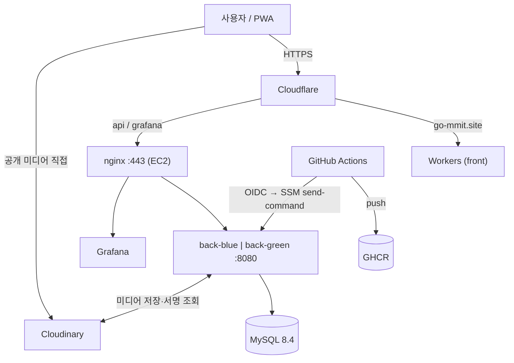

# 인프라 설계

> 인프라 결정의 단일 출처. 변경 시 여기부터 고친다. 실행 절차는 `infra-runbook.md`.
> 최종 수정: 2026-10-05

---

## 1. 개요

- EC2 1대에 Docker Compose 로 `nginx + Spring Boot(blue/green) + MySQL + 모니터링` 구동
- 프론트는 Cloudflare Workers(정적 자산), DNS·TLS·DDoS 는 Cloudflare, 미디어 원본은 Cloudinary
- 배포: GitHub Actions → GHCR → OIDC → SSM `deploy.sh`
- Terraform: AWS(네트워크·EC2·IAM·Budget) + Cloudflare DNS 레코드. 로컬 state



### 제약 (Q30)

- **계정**: 신규 가입 Paid plan + advanced features 활성화. 워크로드는 프로젝트(member) 계정. 로컬은 `aws login` 역할 세션 + `export-credentials` 임시 키
- **비용**: 가입 크레딧 $100. Budget 이 정지 금액에서 EC2 자동 stop
- **리전**: 서울(`ap-northeast-2`). SCP RegionFloor 에 서울 추가
- **네이밍**: 리소스 `team1-<컴포넌트>`, 태그 `Team`(provider `default_tags`)
- **시크릿**: 커밋 금지

---

## 2. 결정 사항

### Q3 — EC2

| 항목 | 결정 |
|---|---|
| AMI | Amazon Linux 2023 x86_64 (`most_recent` 조회, 변경은 무시) |
| 타입 | `t3a.medium` (2 vCPU, 4GB) |
| Swap | 파일 2GB, `swappiness=10` |
| EBS | 루트 gp3 20GB 암호화 단일. MySQL 은 named volume (Q13) |
| EIP | 1개. stop/start 후에도 IP 유지 |
| 보안그룹 | 443 = Cloudflare IPv4 대역만. 22 = 기본 미개방 (Q14) |
| 메타데이터 | IMDSv2 강제 |
| 가동 | 24시간. `StatusCheckFailed_Instance` 5분 → 자동 reboot + 메일 |

**비용 개산** (서울, 2026-09): t3a.medium ≈ $34 + gp3 ≈ $2.7 + 퍼블릭 IPv4 ≈ $3.6 → 월 ≈ $41. 크레딧 $100 ≈ 2.5개월.

### Q5·Q13 — DB / 스토리지 / 백업

- RDS 대신 **EC2 안 MySQL 8.4 컨테이너** (비용 0, 규모 작음). 전환 시 `.env` `DB_HOST` 만 교체
- `utf8mb4` / `utf8mb4_0900_ai_ci`, 호스트 `127.0.0.1:3306` 에만 바인딩
- 데이터 = `mysql-data` named volume (루트 볼륨 위)
- 백업: 호스트 cron 04:20 `backup.sh` → `mysqldump | gzip`, 로컬 7일 보관. binlog 도 7일. EBS 스냅샷은 필요 시 수동(DLM 미사용)

### Q7 — DNS / TLS

- Cloudflare 프록시 ON + SSL **Full (strict)** + 오리진에 **Origin CA 인증서**(와일드카드, 15년)
- Cloudflare 업로드 한도 100MB 는 이 앱에서 실질 제약 아님 (업로드는 사진·짧은 클립뿐)
- 비공개 미디어는 `Cache-Control: private, no-store` 라 Cloudflare 가 캐시하지 않음 → 대역폭 = EC2 아웃바운드

### Q8 — 프론트 / PWA / 도메인

- Cloudflare Workers(정적 자산). Workers Builds Git 연동이 끊겨 `.github/workflows/deploy-front.yml`(`wrangler deploy`)로 배포
- apex `go-mmit.site` = 프론트, `api.go-mmit.site` = 백엔드. `CORS_ALLOWED_ORIGINS=https://go-mmit.site`
- PWA: `vite-plugin-pwa` 로 service worker 생성 (`autoUpdate`, 앱셸 precache, `/api` network-first). manifest 만으로는 Android 설치가 안 됨

### Q9·Q21·Q28 — 이미지 빌드 / 배포 / 롤백

- 트리거: `main` push(`back/**`, `infra/{docker,compose,nginx}/**`, `deploy.yml`) + `workflow_dispatch`
- build: `linux/amd64` 이미지 → GHCR `back:<sha12>` + `back:latest`
- deploy: `production` environment(필수 리뷰어) → OIDC → SSM `deploy.sh <sha12> <full-sha>`
- `deploy.sh`: 활성 색 판별 → `src` 를 배포 커밋으로 → 설정 동기화 → 비활성 색 기동·health → nginx 전환 → 옛 색 stop. 실패 시 활성 색 유지
- 인스턴스가 꺼져 있으면 push 배포는 실패. 재기동은 dispatch `start_if_stopped=true` 로만 (Budget 정지를 push 가 풀지 않게)
- Flyway 는 앱 부팅 시 자동
- 롤백: SSM 으로 `deploy.sh <이전-sha12> <이전-full-sha>` (runbook 3)

### Q10 — 시크릿

- `/opt/team1-app/.env` 최초 1회 수동 배치(`chmod 600`). 항목은 `infra/compose/.env.example` 이 단일 출처
- `deploy.sh` 는 `IMAGE_TAG` 만 갱신. 시크릿 변경은 SSM 셸로 `.env` 직접 수정
- GitHub Secrets 는 `EC2_INSTANCE_ID`, `AWS_DEPLOY_ROLE_ARN` 만
- GHCR 패키지는 private. EC2 는 `read:packages` PAT 로 1회 `docker login`

### Q11·Q18 — 배치 / DailyLog

- 새벽 4시 정산은 `@Scheduled` (Spring Batch 미사용)
- DailyLog 몽타주: `@Scheduled` 스윕(04~17시, 15분 간격). 저장은 Cloudinary, 서빙은 서버 프록시
- job 은 멱등: 완료 여부 체크 → 고정 키 덮어쓰기 → 임시파일 `finally` 삭제. 재부팅·Budget 정지 후 재실행 대비

### Q14 — 접속

- 배포·셸은 **SSM** (22 미개방). 443 은 Cloudflare IP 대역만 (오리진 우회 차단)
- **추가결정 — SSH 예외**: SSM 을 못 쓰는 운영자만 `var.ssh_allowed_cidrs` 에 `/32` 로 22 허용 (기본 `[]`). 키는 `authorized_keys` 수동 등록. `0.0.0.0/0` 은 validation + tftest 가 차단

### Q15 — Cloudflare 관리 범위

- DNS 레코드(`api`, `grafana`)만 Terraform. EIP 가 바뀌어도 apply 한 번에 갱신
- Workers 설정은 대시보드. 토큰은 Zone.DNS 편집 권한만

### Q17 — 블루-그린

- `back-blue` / `back-green` 중 하나만 상시 running. 활성 색 = `nginx/conf.d/active-backend.conf`(git 비추적, `deploy.sh` 가 씀)
- 부팅 시 systemd 가 `start.sh` 로 활성 색만 기동

### Q22 — Terraform state

- 로컬 state + **인프라 담당자 1인만 apply**. apply 후 `terraform.tfstate` 를 팀 드라이브에 백업(시크릿 취급). `*.tfstate*` 는 git 제외
- 여러 명이 apply 해야 하면 HCP Terraform 무료 tier 로 전환

### Q23 — 도메인

- `go-mmit.site` 는 placeholder. 구매 시 `variables.tf` `domain`, nginx `server_name`, `.env` `CORS_ALLOWED_ORIGINS`, Workers 커스텀 도메인 일괄 치환
- 등록기관은 Cloudflare Registrar (네임서버 자동)

### Q24 — 컨테이너 이미지 / 메모리

- `eclipse-temurin:25-jre` + ffmpeg, `mysql:8.4`, `nginx:1.27-alpine`
- JVM `-Xms256m -Xmx768m`. MySQL `innodb_buffer_pool_size=256M`, `max_connections=50`
- 메모리 한도(`deploy.resources.limits.memory`, cgroup 하드 한도. 초과 시 그 컨테이너만 OOM-kill, swap 으로 못 막음):

  | 서비스 | 한도 |
  |---|---|
  | back(활성 색 1개, JVM + ffmpeg) | 1600M |
  | mysql | 600M |
  | prometheus / loki / grafana / promtail | 450M / 350M / 200M / 64M |
  | nginx | 64M |
  | **합** | **3,328M** / 4,096M (배포 중 잠시 두 색 공존) |

**ffmpeg 확장 순서** (필요할 때만):

| 단계 | 조건 | 조치 |
|---|---|---|
| 1. 현행 | — | `back` 컨테이너 안에서 실행 |
| 2. 사이드카 | OOM-kill 2회 이상, 또는 인코딩이 주간 요청과 겹침 | 같은 compose 에 ffmpeg 전용 컨테이너, 메모리 한도 분리 |
| 3. 오프로드 | 인코딩량 실제 증가 | 잡 단위 Fargate 또는 MediaConvert |

### Q25 — nginx

- `client_max_body_size 20m` ≥ Spring multipart 12MB/15MB (nginx 가 먼저 자르면 Spring 이 에러 응답을 못 줌)
- `/api/media/`: `proxy_buffering off`, `proxy_read_timeout 300s` (스트리밍)
- 로그인·회원가입·비밀번호 변경: `limit_req` 10r/m. Cloudflare 룰이 1차
- gzip 생략 (Cloudflare 가 사용자 구간 압축)
- `real_ip_header CF-Connecting-IP`

### Q26·Q27 — Actuator / 비공개 미디어 인증

- Actuator 노출: `health`, `prometheus` 만 permitAll. 나머지 401
- 비공개 미디어: 프론트가 `fetch` + `Authorization` → blob URL. httpOnly 쿠키는 피드 이미지 부하가 생기면 도입
- 사용자에게 Cloudinary signed URL 을 주지 않는다 (재공유 차단). 서버가 매 요청 인가 후 스트리밍

### Q29 — 모니터링

- Prometheus + Loki + Promtail + Grafana 를 같은 EC2 에 자체 호스팅 (`infra/monitoring/`)
- 메트릭은 앱만(`/actuator/prometheus`). Prometheus/Loki 는 도커 내부망 전용
- 외부 공개는 `grafana.go-mmit.site` 만: nginx Basic Auth(1차) + Grafana 로그인(2차). `grafana.htpasswd` 는 커밋 안 함
- 보존: TSDB·Loki 7일
- 로그: prod `logging.structured.format.console: logstash`, Loki 라벨은 `app`/`container` 만. 컨테이너 로그 파일은 10MB×3 로 순환
- 대시보드: `provisioning/dashboards/json/*.json` 자동 로드(현재 JVM Micrometer #4701). UI 저장 불가(`allowUiUpdates` 기본 false) → JSON export 후 커밋. grafana.com JSON 은 `${DS_PROMETHEUS}` 등 플레이스홀더를 데이터소스 이름으로 치환
- 알림 없음 (인스턴스 reboot·Budget 메일만)

### Q30 — 계정 이전 + 크레딧 가드 (2026-10-05)

- 새 리포 `prgrms-ildangback/NBE10-12-final-ildangback`, 새 AWS 계정
- OIDC provider 생성이 기본 SCP 에 막혀 advanced features 활성화 → OIDC Push 배포 유지. provider 는 Terraform 리소스
- provider `allowed_account_ids` 로 다른 계정 profile apply 방지
- 24시간 가동 (옛 계정의 18:00 정지·03:30 기동 스케줄 삭제)
- **Budget** (`budget.tf`, 금액은 tfvars): 크레딧 제외·VAT 포함, `budget_start` 부터 12개월 누적(ANNUALLY — provider 5.x 는 CUSTOM 미지원)
  - 메일: 실제 `budget_alert_usd`(예: $50·$80), 예측 `budget_limit_usd`(예: $100)
  - **`budget_stop_usd`(예: $95)에서 EC2 자동 stop**. Budget 데이터 지연과 정지 후 EBS/EIP 비용 때문에 한도보다 낮게
  - 이후 운영 여부는 팀 결정

---

## 3. 파일 구성

```
infra/
  terraform/
    versions.tf providers.tf variables.tf outputs.tf
    network.tf        # VPC / IGW / 퍼블릭 서브넷 1 / 라우트
    security.tf       # SG: 443 = Cloudflare 대역, 22 = ssh_allowed_cidrs 예외
    iam.tf            # EC2 SSM 역할, GitHub OIDC provider + 배포 역할
    ec2.tf            # EC2, EIP, reboot 알람
    dns.tf            # api / grafana A 레코드 (proxied)
    budget.tf         # Budget, EC2 자동 stop
    alerts.tf         # SNS 토픽 + 메일 구독 (Budget·reboot 알람 공용)
    tests/infra.tftest.hcl
  bootstrap/user-data.sh   # swap, docker, SSM 에이전트, backup cron, systemd 유닛
  docker/Dockerfile        # temurin:25-jdk 빌드 → 25-jre + ffmpeg
  compose/                 # docker-compose.yml, .env.example, deploy.sh, start.sh(부팅 기동), backup.sh
  nginx/                   # nginx.conf, conf.d/{api,grafana}.conf
  monitoring/              # prometheus, loki, promtail, grafana provisioning

.github/workflows/
  deploy.yml       # build → deploy (OIDC → SSM)
  infra-ci.yml     # fmt/validate/test 는 머지 차단, tflint/hadolint/shellcheck/actionlint 는 리포트만
```

### 테스트 — 깨지면 무슨 사고가 나는가

`terraform test` 는 `mock_provider` 라 자격증명·비용 없음.

| 검사 | 막는 사고 |
|---|---|
| security_group_locks_origin / ssh_exception_is_narrow | 443·22 가 넓게 열려 오리진 직접 노출 |
| instance_is_hardened_and_cheap | 타입 상향, IMDSv1, 볼륨 평문, user_data 수정 시 재생성, IAM 프로파일 누락 |
| credit_budget_stops_ec2 | 크레딧 포함 집계, 월 단위 집계, 자동 stop 해제·한도 이상 |
| status_check_reboots_instance | OS 무응답 방치 |
| deploy_oidc_is_environment_scoped | 임의 브랜치·PR 의 배포 역할 탈취 |
| api_dns_is_proxied | 오리진 IP 노출 + SG 와 충돌해 접속 불가 |
| `ActuatorSecurityTest` | health/prometheus 비공개화(헬스체크·scrape 실패), 기타 actuator 공개 |

---

## 4. 남은 확인 사항

- **도메인 구매** 후 Q23 치환
- **첫 청구서**: VAT 가 크레딧 적용 전/후 어느 금액에 붙는지 Tax 라인 확인
- **Workers Git 연동** 복구 시 `deploy-front.yml` 과 둘 중 하나로 정리
- **쿠키 인증** 도입 시 미디어 설계 메모의 "동일 오리진" → "동일 site" 문구 조정
